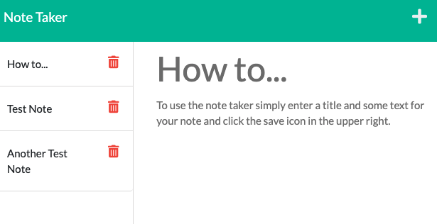

# Express Note Taker

## Description
This project required the creation of a back-end application that would result in the front-end code functioning correctly. Using the Express framework I was able to write server code that accomplishing that requirement.
## Table of Contents
- [Installation](#installation)
- [Usage](#usage)
- [Contributions](#contributions)
- [Testing Information](#testing)
- [License](#license)
- [Questions](#questions)
## Installation
To install this application type npm install into the command line.
## Usage
To use this application locally you must launch the server in the command line. To use this application on the web click [here](https://safe-escarpment-00769.herokuapp.com/notes).

## Contributions

## Testing
No testing packages are provided in this application.

## License
This project is covered under a/an MIT license. For more information see GitHub documentation on licensing a project [here](https://docs.github.com/en/communities/setting-up-your-project-for-healthy-contributions/adding-a-license-to-a-repository).

## Questions
​For questions, get in touch on [GitHub](https://github.com/bryan-barnes12/) or email me at [theonlysweetbeebles@gmail.com](mailto:theonlysweetbeebles@gmail.com).
    